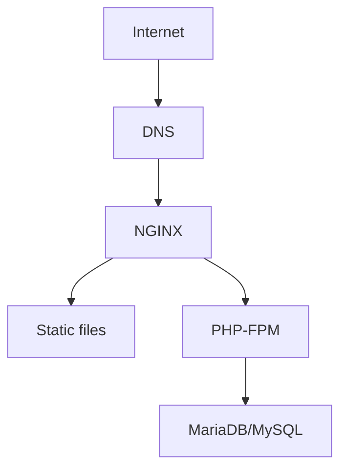

# lemp-php-deploy

> **Friendly repo name:** `lemp-php-deploy`

---

## Project summary

This repository contains a clear, step-by-step **README.md** for creating and deploying a PHP application on a **LEMP** stack (Linux, Nginx, MySQL/MariaDB, PHP-FPM). It's designed for beginners and intermediate devops/devs who want a reliable, repeatable process for provisioning a server, installing the LEMP stack, configuring services, deploying code, securing the instance, and troubleshooting common issues.

---

## Table of contents

1. Prerequisites
2. Repository layout
3. Quickstart — one-command local test
4. Step-by-step server setup (Ubuntu 22.04+ recommended)
5. Nginx server block (example)
6. PHP app deployment steps (clone, permissions, config)
7. Database setup and migrations
8. Secure the server (UFW, SSL via Certbot)
9. Continuous deployment notes (optional)
10. Troubleshooting & tips
11. Diagram
12. License

---

## 1) Prerequisites

* A fresh **Ubuntu 20.04/22.04/24.04** server (or Debian derivative). Commands below target Ubuntu but apply with minor changes to Debian.
* Non-root user with `sudo` privileges (recommended).
* Basic knowledge of the terminal, SSH, and Git.
* A domain name pointed to your server's public IP (optional but recommended for SSL).
* This README assumes package manager `apt` and `systemd`.

---

## 2) Repository layout

```
lemp-php-deploy/
├─ README.md              # this file
├─ nginx/                 # example nginx config files
│  └─ example.conf
├─ php/                   # example PHP app
│  ├─ index.php
│  └─ .env.example
├─ scripts/               # helpful server scripts (optional)
│  └─ setup-lemp.sh       # automated setup script (optional)
└─ docs/                  # extra docs, diagrams
```

---

## 3) Quickstart — one-command local test

If you only want to see a working PHP page locally (no server):

```bash
# run a quick php built-in server from the php/ folder
git clone <this-repo-url>
cd lemp-php-deploy/php
php -S 127.0.0.1:8080
# open http://127.0.0.1:8080 in your browser
```

This helps verify the PHP app itself is fine before deploying to a LEMP server.

---

## 4) Step-by-step server setup (Ubuntu)

> Run these commands on your server as a sudo user.

### Update & basic packages

```bash
sudo apt update && sudo apt upgrade -y
sudo apt install -y software-properties-common curl git
```

### 1. Install Nginx

```bash
sudo apt install -y nginx
sudo systemctl enable --now nginx
sudo systemctl status nginx
```

### 2. Install MariaDB (or MySQL)

```bash
sudo apt install -y mariadb-server
sudo systemctl enable --now mariadb
sudo mysql_secure_installation
```

**Answer the prompts** (set root password or use unix_socket auth depending on your choice). Keep a strong password.

### 3. Install PHP and common extensions

Install PHP-FPM and extensions commonly required by PHP apps (adjust `php8.2` to the version available on your distro):

```bash
sudo apt install -y php-fpm php-mysql php-cli php-curl php-xml php-mbstring php-zip php-intl php-gd
```

Verify PHP-FPM is running:

```bash
sudo systemctl enable --now php8.2-fpm
sudo systemctl status php8.2-fpm
```

> If your distribution uses a different version (eg `php8.1-fpm`), replace `8.2` accordingly.

### 4. Configure PHP-FPM (optional tuning)

Edit `/etc/php/8.2/fpm/php.ini` (or matching path) for `upload_max_filesize`, `post_max_size`, `memory_limit`, `date.timezone`:

```ini
upload_max_filesize = 50M
post_max_size = 50M
memory_limit = 256M
; set your timezone
date.timezone = "Asia/Kolkata"
```

Restart PHP-FPM:

```bash
sudo systemctl restart php8.2-fpm
```

### 5. Allow firewall (UFW)

```bash
sudo apt install -y ufw
sudo ufw allow OpenSSH
sudo ufw allow 'Nginx Full'   # opens 80 & 443
sudo ufw enable
sudo ufw status
```

---

## 5) Nginx server block — example

Create `/etc/nginx/sites-available/example.com` and link it to `sites-enabled`.

```nginx
server {
    listen 80;
    listen [::]:80;
    server_name example.com www.example.com;

    root /var/www/example.com/public;
    index index.php index.html index.htm;

    access_log /var/log/nginx/example.com.access.log;
    error_log /var/log/nginx/example.com.error.log;

    location / {
        try_files $uri $uri/ /index.php?$query_string;
    }

    location ~ \.php$ {
        include snippets/fastcgi-php.conf;
        fastcgi_pass unix:/run/php/php8.2-fpm.sock;
    }

    location ~ /\.ht {
        deny all;
    }
}
```

Enable and test:

```bash
sudo ln -s /etc/nginx/sites-available/example.com /etc/nginx/sites-enabled/
sudo nginx -t
sudo systemctl reload nginx
```

Adjust `php8.2-fpm.sock` to your PHP version.

---

## 6) Application deployment steps

1. Create webroot and set permissions:

```bash
sudo mkdir -p /var/www/example.com/public
sudo chown -R $USER:$USER /var/www/example.com
sudo chmod -R 755 /var/www/example.com
```

2. Clone the repo into webroot:

```bash
cd /var/www/example.com
git clone https://github.com/yourusername/your-repo.git .
# or copy files into /var/www/example.com/public
```

3. If your app uses Composer:

```bash
sudo apt install -y composer
composer install --no-dev --optimize-autoloader
```

4. Create environment file and set permissions:

```bash
cp .env.example .env
# edit .env with DB credentials, APP_URL, etc.
chmod 640 .env
```

5. Ensure `storage` and `cache` (if applicable) are writable by the web server user (www-data):

```bash
sudo chown -R www-data:www-data /var/www/example.com/storage /var/www/example.com/cache || true
sudo chmod -R 775 /var/www/example.com/storage
```

6. Restart services:

```bash
sudo systemctl restart php8.2-fpm nginx
```

7. Visit `http://example.com` (or your server IP) to confirm the site loads.

---

## 7) Database setup

Log into MariaDB and create DB & user:

```sql
sudo mysql -u root -p
CREATE DATABASE example_db CHARACTER SET utf8mb4 COLLATE utf8mb4_unicode_ci;
CREATE USER 'example_user'@'localhost' IDENTIFIED BY 'StrongPasswordHere';
GRANT ALL PRIVILEGES ON example_db.* TO 'example_user'@'localhost';
FLUSH PRIVILEGES;
EXIT;
```

If using migration tools (Laravel, Phinx, etc.), run them now. Example (Laravel):

```bash
php artisan migrate --force
```

---

## 8) Secure the server (HTTPS)

Install Certbot and get a certificate (assuming domain is pointed correctly):

```bash
sudo apt install -y certbot python3-certbot-nginx
sudo certbot --nginx -d example.com -d www.example.com
# follow the interactive prompts
```

Certbot will update your Nginx config to redirect HTTP to HTTPS. Check `sudo nginx -t` and reload if needed.

---

## 9) Continuous deployment (basic ideas)

* Use GitHub Actions / GitLab CI to build and push artifacts.
* On the server, use a simple `git pull` inside `/var/www/example.com` triggered by a webhook or a deployment user.
* Safer: create an artifact on CI, upload via scp, then run deployment script on server that:

  * stops queue workers
  * pulls artifact
  * runs composer install & migrations
  * restarts PHP-FPM & clears caches

Example simple deployment script `scripts/deploy.sh`:

```bash
#!/bin/bash
cd /var/www/example.com
git pull origin main
composer install --no-dev --optimize-autoloader
php artisan migrate --force
sudo systemctl reload php8.2-fpm nginx
```

Use a CI secret to SSH into server for zero-downtime or small-downtime deploys.

---

## 10) Troubleshooting & tips

* **Blank page / 500 error**: check Nginx error logs (`/var/log/nginx/example.com.error.log`) and PHP-FPM logs (`/var/log/php8.2-fpm.log` or `journalctl -u php8.2-fpm`).
* **Permission errors**: ensure `www-data` owns writable directories.
* **Socket not found**: check `fastcgi_pass` path in nginx snippet (match your php-fpm socket path). Use `ps aux | grep php-fpm` to find the active socket or use `127.0.0.1:9000` if php-fpm is configured for TCP.
* **Database connection refused**: verify `.env` DB host and MySQL user privileges.

---

## 11) Diagram

### ASCII diagram (simple)

```
Internet
  |
  v
[DNS] -> example.com
  |
  v
[NGINX] (reverse proxy + static files)
  |
  +--> serves static assets
  |
  +--> forwards PHP requests to PHP-FPM socket
         |
         v
      [PHP-FPM]
         |
         v
      [MySQL/MariaDB]
```

### Mermaid diagram (if supported by viewer)



---

## 12) Example files (copy into repo)

**php/index.php**

```php
<?php
// simple index to verify PHP-FPM + NGiNX
phpinfo();
```

**.env.example**

```
APP_ENV=production
APP_DEBUG=false
APP_URL=https://example.com
DB_HOST=127.0.0.1
DB_PORT=3306
DB_DATABASE=example_db
DB_USERNAME=example_user
DB_PASSWORD=ChangeMeStrong!
```

**nginx/example.conf**

> See the server block in section 5 above. Save it as `nginx/example.conf` in this repo for reference.

---

## 13) Final notes

* Replace `example.com`, usernames, and passwords with your real values.
* Keep backups of your database and any persistent storage (use `mysqldump`, cloud snapshots, or managed DB backups).
* For production, consider additional hardening: Fail2ban, unattended-upgrades for security updates, regular log rotation, monitoring (Prometheus/Grafana), and automated backups.

---

## License

MIT — use freely and modify as you need.

---

If you want, I can:

* convert this into a ready-to-commit `README.md` file in the repo, or
* generate the `scripts/setup-lemp.sh` script automating many of the above steps, or
* produce a Docker-based `docker-compose.yml` to run a LEMP stack locally.

Tell me which one you'd like next.
